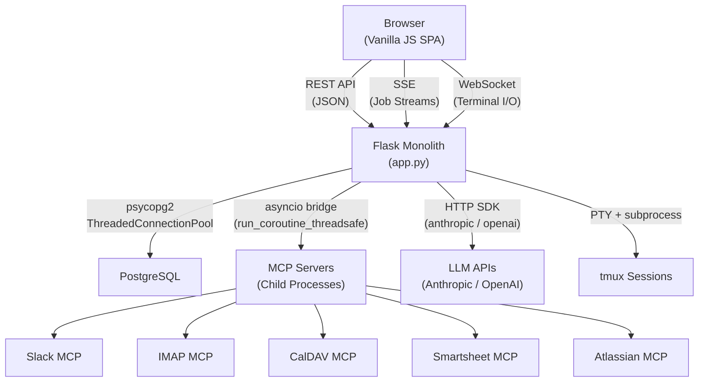
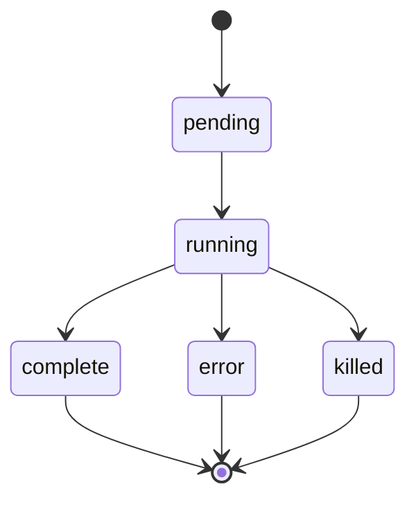

# Dossie -- Architecture Overview

## 1. Product Description

Dossie is a self-hosted, AI-powered executive assistant and todo management system. It is built as a single-file Flask monolith (`app.py`, ~9,700 lines) with an embedded single-page application (vanilla HTML/CSS/JS inlined in the same file).

### Key Capabilities

- **Todo management** -- sections, priorities (high/medium/low/none), completion tracking, markdown descriptions, undo/redo
- **Agentic AI chat** -- dual-provider support for Anthropic (streaming) and OpenAI-compatible APIs (non-streaming), with an autonomous tool-use loop that can read/write todos, spawn sub-agents, and invoke MCP tools
- **MCP integrations** -- connects to five categories of external services via the Model Context Protocol:
  - Slack (messaging, channel management)
  - Email/IMAP (read, search, send, spam management)
  - Calendar/CalDAV (events, scheduling)
  - Smartsheet (project management, sheets, rows)
  - Atlassian/Jira/Confluence (issues, pages, search)
- **WebSocket terminal sessions** -- tmux-backed PTY sessions for interactive shell access, recoverable across server restarts
- **Multi-user auth** -- PostgreSQL-backed user registration, bcrypt password hashing, session-token cookies
- **Executive assistant mode** -- automated status updates, context file management, job scheduling

---

## 2. High-Level Architecture Diagram



---

## 3. Deployment Topology

Dossie runs as a single process with a single worker. This is a hard requirement -- several critical subsystems (the MCP manager cache, job tracking, PTY session registry, undo stacks) are stored in in-memory Python dicts. Running multiple workers would cause data inconsistency and lost state.

| Component | Technology | Notes |
|---|---|---|
| Application | Python 3.11-slim + Node.js (for MCP servers) | Single Docker container |
| Reverse proxy | Caddy | TLS termination, WebSocket proxying |
| Database | PostgreSQL | Required for multi-user; optional in file mode |
| Worker model | Single-process, single-worker | In-memory state prevents horizontal scaling |

The container image bundles both the Python runtime and a Node.js runtime. Node.js is required because MCP servers (Slack, IMAP, CalDAV, Smartsheet, Atlassian) are typically implemented as Node.js processes launched via `stdio` transport.

---

## 4. Operational Modes

Dossie supports two mutually exclusive operational modes, selected at startup based on the presence of the `DATABASE_URL` environment variable.

### 4a. File Mode

Active when `DATABASE_URL` is **not** set.

- Todos are read from and written to a markdown file (`todos.md` by default, configurable via CLI argument)
- Chat conversations are stored in `todos-chats.json`
- Configuration is stored in a `todos-config/` directory alongside the todo file
- Undo history is held in a global in-memory `deque` (max 30 entries)
- No authentication -- all requests are served as a stub `"local"` user
- Single-user only

### 4b. DB Mode

Active when `DATABASE_URL` **is** set.

- All data (users, todos, sections, chats, messages, config, context files, MCP preferences, server accounts) is stored in PostgreSQL
- Authentication via bcrypt-hashed passwords + session tokens stored in cookies
- Per-user data isolation -- all queries are scoped by `user_id`
- Per-user undo stacks held in `_undo_stacks` dict (keyed by `user_id`)
- Per-user MCP manager instances cached in `_mcp_managers` dict

The mode is determined once at startup (`app.py:9682-9686`) and stored in the global `_USE_DB` flag, which gates behavior throughout the codebase.

---

## 5. Component Architecture

### 5a. Flask Application (`app.py` -- 9,713 lines)

The entire server is a single-file Flask application with an embedded SPA. It uses `flask_sock` for WebSocket support. There are no Blueprints or separate route modules -- all routes, classes, utilities, and the full HTML/CSS/JS frontend are in one file.

#### Code Map

| Line Range | Contents |
|---|---|
| 1--113 | Imports, `.env` loading, globals (`_USE_DB`, `_undo_stack`, `_jobs`, `_pty_sessions`), `get_current_user()`, `require_user()` |
| 114--353 | `MCPManager` class |
| 354--892 | MCP utilities: tool filtering, per-user permissions, config loading, OAuth token handling, server registry |
| 893--1058 | File-mode markdown parser (`_parse_todo_file`), writer (`_write_todo_file`), undo system (`_push_undo`, `_pop_undo`) |
| 1059--1130 | Auth routes: `POST /api/auth/register`, `POST /api/auth/login`, `POST /api/auth/logout`, `GET /api/auth/me`, `GET /` (serves login or app page) |
| 1132--1717 | Todo CRUD routes, sections routes, `POST /api/execute-tool` endpoint |
| 1719--1832 | Claude CLI subprocess runner (`_run_claude_job`) |
| 1833--2131 | Tool definitions (`_get_tool_definitions`) and `_execute_tool()` dispatch function |
| 2132--2305 | Sub-agent spawning (`_execute_spawn_agents`) |
| 2307--2435 | System prompt builder (`_build_system_prompt`) and related utilities |
| 2436--2835 | `ChatAgent` class |
| 2838--3206 | Local chat runner (`_run_chat_local`), provider resolver, job helpers |
| 3208--3388 | Chat routes: `POST /api/chat`, `GET /api/chats`, `GET /api/chats/<id>`, `DELETE /api/chats/<id>` |
| 3389--3588 | Config routes, MCP status/reconnect/approve routes |
| 3590--3941 | MCP server accounts and OAuth routes |
| 3942--4089 | History and Git routes |
| 4090--4295 | Terminal routes and WebSocket handler (`_terminal_io_loop`) |
| 4296--4449 | EA update route, jobs routes |
| 4451--4527 | `LOGIN_PAGE` -- inline HTML for login/registration form |
| 4528--9665 | `HTML_PAGE` -- full SPA (inline CSS ~1,000 lines, inline JS ~4,000 lines) |
| 9667--9713 | Main entry point: arg parsing, DB init, MCP cleanup registration, tmux recovery, `app.run()` |

#### Key Globals

- `_USE_DB: bool` -- gates file-mode vs. DB-mode behavior
- `_jobs: dict[str, dict]` -- in-memory job tracker for all long-running operations
- `_pty_sessions: dict[str, dict]` -- registry of active tmux terminal sessions
- `_mcp_managers: dict[str, MCPManager]` -- per-user MCP manager instances
- `_mcp_managers_lock: threading.Lock` -- synchronizes manager creation/teardown
- `_undo_stack / _undo_stacks` -- undo history (global for file mode, per-user dict for DB mode)

---

### 5b. Database Layer (`db.py` -- 1,086 lines)

The database layer is a standalone module providing connection pooling, schema management, and domain-specific CRUD functions. It has no knowledge of Flask -- it operates purely on `user_id` parameters and returns plain dicts/lists.

#### Connection Management

- Uses `psycopg2.pool.ThreadedConnectionPool` with 2--20 connections
- The `_conn()` context manager (line 51) acquires a connection, auto-commits on success, rolls back on exception, and always returns the connection to the pool
- Initialization via `init(database_url)` creates the pool and runs migrations
- Cleanup via `close()` calls `_pool.closeall()`

#### Migration System

- Incremental migrations using existence checks (e.g., `SELECT EXISTS (SELECT FROM information_schema.tables ...)` and `SELECT column_name FROM information_schema.columns ...`)
- No version tracking table -- each migration is idempotent and checks whether its target schema element already exists before applying
- Initial schema is applied as a single `SCHEMA` constant if the `users` table does not exist

#### CRUD Function Organization

Functions are organized by domain, all following the same pattern: acquire connection via `_conn()`, execute parameterized SQL, return dicts or lists.

| Domain | Functions |
|---|---|
| Auth | `create_user`, `get_user_by_email`, `create_session`, `get_session_user`, `delete_session` |
| Todos | `get_todos`, `create_todo`, `update_todo`, `delete_todo`, `reorder_todos`, `get_todo` |
| Sections | `get_sections`, `create_section`, `update_section`, `delete_section`, `reorder_sections` |
| History | `record_snapshot`, `get_history` |
| Messages/Chats | `get_conversations`, `get_or_create_conversation`, `save_message`, `get_messages`, `delete_conversation`, `update_conversation` |
| Config | `get_config`, `set_config`, `set_config_key` |
| Context Files | `get_context_files`, `set_context_file`, `delete_context_file` |
| MCP Preferences | `get_mcp_prefs`, `set_mcp_pref`, `get_mcp_tool_prefs`, `set_mcp_tool_pref` |
| Server Accounts | `get_server_accounts`, `set_server_account`, `delete_server_account` |

---

### 5c. MCPManager (`app.py:114--353`)

The `MCPManager` class bridges Flask's synchronous request handlers with the async MCP client library. Each user gets their own `MCPManager` instance, cached in the global `_mcp_managers` dict.

#### Architecture

- A background **daemon thread** runs a dedicated `asyncio` event loop (`self._loop`)
- The MCP `ClientSessionGroup` lives inside this async loop and manages connections to all configured servers
- Sync-to-async bridging is done via `asyncio.run_coroutine_threadsafe()` -- Flask route handlers call synchronous wrapper methods that submit coroutines to the background loop and block on the result

#### Server Types

The manager supports three MCP transport types:
- **stdio** -- launches the MCP server as a child process, communicates over stdin/stdout (used for Slack, IMAP, CalDAV, Smartsheet, Atlassian)
- **SSE** -- connects to a remote MCP server via Server-Sent Events
- **streamable-HTTP** -- connects via the newer streamable HTTP transport

#### Tool Namespacing

MCP tools are namespaced as `mcp__{server}__{tool}` to avoid collisions across servers. For example, a `search_emails` tool from the `imap` server becomes `mcp__imap__search_emails`.

#### Key Methods

| Method | Description |
|---|---|
| `start(server_configs, tokens)` | Spawns the background thread, connects to all configured servers |
| `stop()` | Shuts down the async loop and joins the background thread |
| `get_tool_definitions()` | Returns cached tool definitions in Anthropic API format |
| `call_tool(namespaced_name, arguments)` | Executes a tool call on the appropriate server, returns result |
| `get_status()` | Returns per-server connection status and tool counts |

#### Lifecycle

- Instances are created lazily on first access per user (`_get_mcp_manager`)
- A `threading.Lock` (`_mcp_managers_lock`) prevents race conditions during creation
- On config change, the old manager is stopped and a new one is created
- At shutdown, an `atexit` handler stops all managers

---

### 5d. ChatAgent (`app.py:2436--2835`)

The `ChatAgent` class implements the core agentic AI loop. It handles conversation history, system prompts, streaming output, tool execution, persistence, and cost tracking.

#### Dual-Provider Support

- **Anthropic** -- uses `client.messages.stream()` for real-time token streaming. Emits partial text as it arrives. Detects `tool_use` content blocks in the response.
- **OpenAI-compatible** -- uses `chat.completions.create()` (non-streaming). Supports any OpenAI-compatible endpoint (local models, OpenRouter, etc.).

#### Agentic Loop

The core loop (in `run()`) follows this pattern:

```
1. Build message history (with optional compaction)
2. Call LLM (Anthropic or OpenAI)
3. If response contains tool_use blocks:
   a. Execute tools in parallel via ThreadPoolExecutor
   b. Append tool results to conversation
   c. Persist assistant + tool messages
   d. Go to step 2
4. If response is end_turn or max_tokens: stop
```

#### Auto-Compaction

When a conversation exceeds 100,000 characters and has more than 8 messages, the agent triggers compaction:
- Older messages (keeping the first 4 and last 4) are sent to the LLM with a summarization prompt
- The summary replaces the older messages, capped at 2,048 tokens
- This prevents context window exhaustion in long-running conversations

#### Sub-Agent Spawning

- The `spawn_agents` tool allows the primary agent to launch parallel sub-agents for independent tasks
- Sub-agents have a depth limit of 2 (prevents infinite recursion)
- Maximum parallelism is controlled by `config.max_subagents` (default: 10)
- Sub-agents share the same conversation context but operate independently

#### Cost Tracking

For Anthropic calls, cost is calculated per response:
- Formula: `(input_tokens * $3 + output_tokens * $15) / 1,000,000`
- Cumulative cost is tracked per job and emitted in the output stream

#### Key Methods

| Method | Description |
|---|---|
| `run()` | Main entry point -- orchestrates the full agentic loop |
| `_build_history()` | Assembles message history from DB or in-memory state |
| `_run_anthropic()` | Executes one Anthropic API call with streaming |
| `_run_openai()` | Executes one OpenAI-compatible API call |
| `_persist_response()` | Saves assistant and tool messages to DB |
| `_maybe_compact()` | Triggers auto-compaction if conversation is too long |
| `emit(text)` | Appends a line to the job's output stream |

---

### 5e. Job System

The job system tracks all long-running operations (chat conversations, EA updates, Claude CLI runs) and provides SSE-based streaming of their output to the browser.

#### Data Structure

Jobs are stored in the global `_jobs` dict, keyed by job ID (UUID string). Each job contains:

```python
{
    "id": str,              # UUID
    "label": str,           # Human-readable description
    "job_key": str,         # Deduplication key (e.g., "chat:{todo_id}")
    "status": str,          # "pending" | "running" | "complete" | "error" | "killed"
    "output_lines": list,   # Accumulated output lines
    "proc": subprocess,     # Subprocess handle (if applicable)
    "created_at": float,    # time.time() timestamp
    "user_id": str,         # Owner
    "todo_id": str | None,  # Associated todo (if any)
    "conversation_id": str, # Chat conversation ID
    "_stream": object       # API stream handle (for kill support)
}
```

#### Status Lifecycle



#### SSE Streaming

The client polls `GET /api/jobs/<id>/stream` which returns an SSE (`text/event-stream`) response. The server polls the job's `output_lines` list at ~50ms intervals and emits new lines as SSE `data:` events. When the job reaches a terminal status, a final `event: done` is sent and the stream closes.

#### Auto-Purge

Stale jobs (completed, errored, or killed for more than 30 minutes) are automatically removed from the `_jobs` dict. Purging is triggered as a side effect of `GET /api/jobs`.

#### Kill Support

Killing a job involves:
1. Closing the API stream handle (`_stream`) to abort any in-flight LLM call
2. Killing the subprocess tree via `os.killpg()` (sends SIGTERM to the entire process group)
3. Setting the job status to `"killed"`

---

### 5f. Terminal/PTY Manager (`app.py:4090--4295`)

The terminal subsystem provides browser-based shell access via tmux-backed pseudo-terminal sessions, bridged to the client over WebSocket.

#### Session Lifecycle

1. **Creation** (`POST /api/todos/<todo_id>/terminal`) -- creates a new tmux session via `subprocess.Popen` with PTY allocation. Stores session metadata in the `_pty_sessions` dict.
2. **WebSocket bridge** (`@sock.route("/ws/terminal/<session_id>")`) -- the `_terminal_io_loop` function bridges the PTY file descriptor and the WebSocket connection using `select.select()` in a non-blocking polling loop.
3. **Resize** -- the client sends resize commands over WebSocket, which are applied via the `TIOCSWINSZ` ioctl.
4. **Close** -- kills the process tree associated with the session and removes it from the registry.

#### Session Data Structure

```python
_pty_sessions[session_id] = {
    "id": str,              # UUID
    "todo_id": str,         # Associated todo
    "title": str,           # Display title
    "tmux_target": str,     # tmux session:window target
    "alive": bool,          # Whether session is still running
    "created_at": str,      # ISO timestamp
    "needs_auto_send": bool,# Whether to auto-send initial command
    "resume_id": str | None # Conversation ID to resume
}
```

#### Recovery

At server startup, `_tmux_recover_sessions()` (called at line 9709) queries tmux for any surviving sessions from a previous server run and re-populates the `_pty_sessions` dict. This allows terminal sessions to survive server restarts as long as the tmux server process is still alive.

#### WebSocket I/O Bridge

The `_terminal_io_loop` function:
1. Opens the PTY master file descriptor in non-blocking mode
2. Enters a loop using `select.select()` to multiplex between PTY output and WebSocket input
3. PTY output is forwarded to the WebSocket as binary frames
4. WebSocket input (keystrokes) is written to the PTY master fd
5. On disconnect or error, the loop exits and the session is cleaned up
