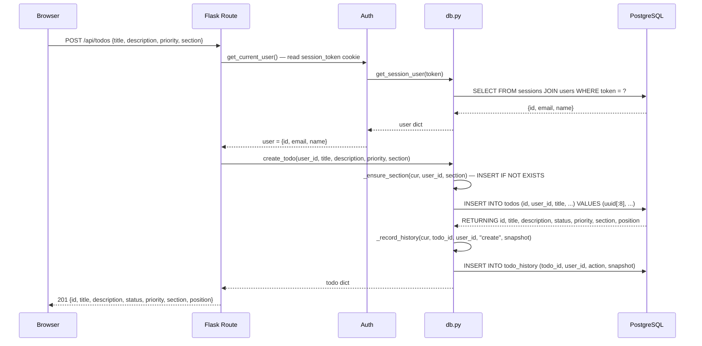
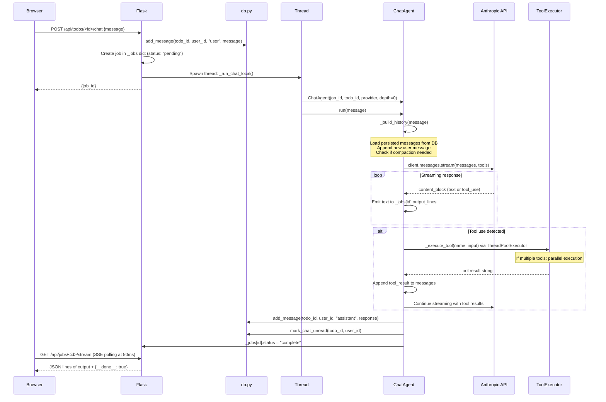
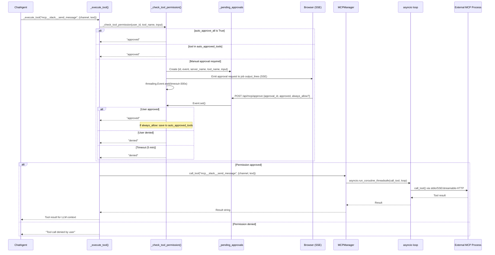
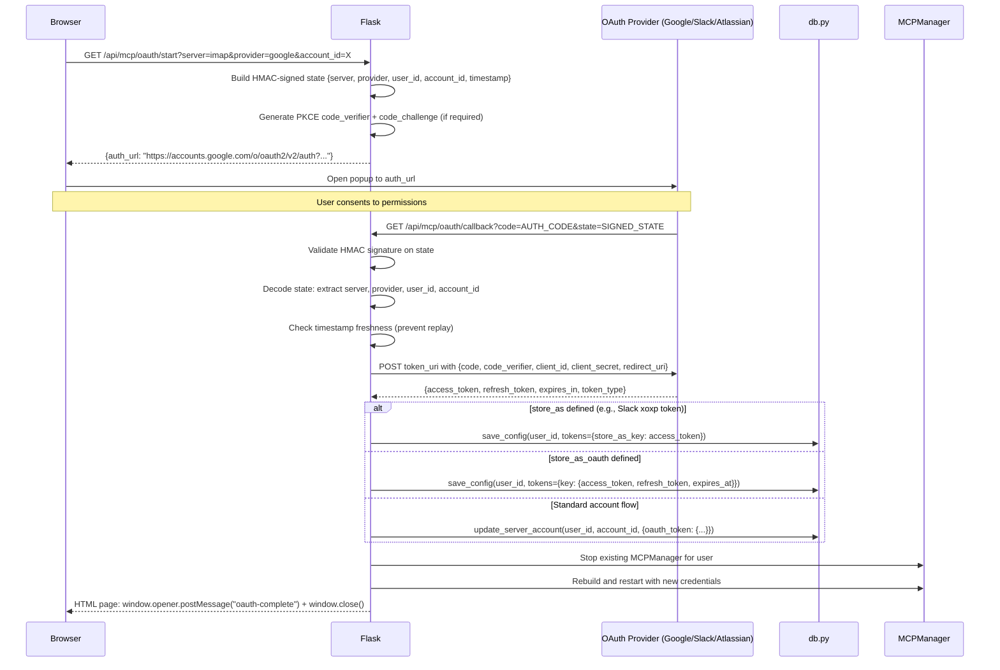
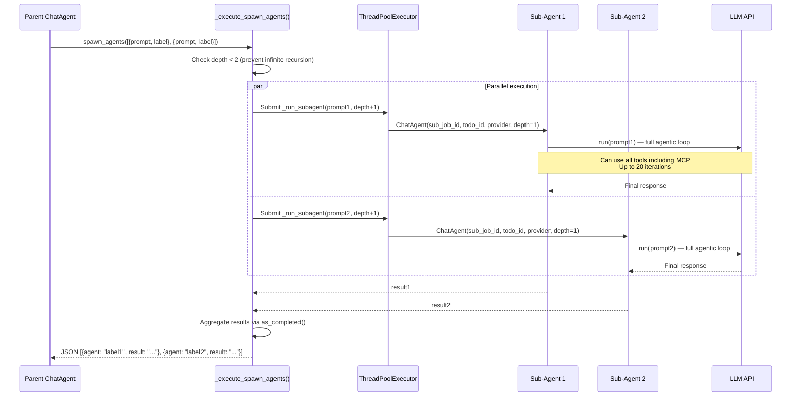
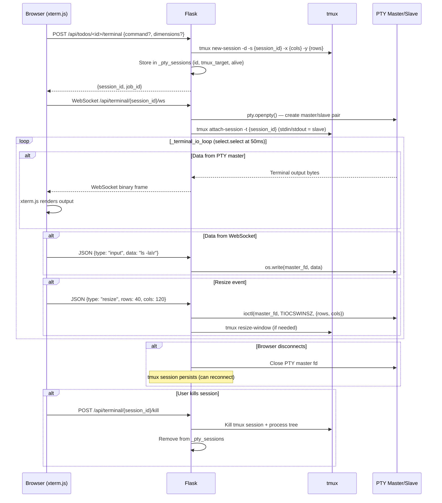

# Data Flows

Six sequence diagrams covering the major data flows in Dossie. Each includes a Mermaid diagram, step-by-step explanation, and error handling notes.

---

## 1. Todo CRUD (DB Mode)

### Create Todo

### Step-by-Step

1. Browser sends `POST /api/todos` with JSON body containing at minimum a `title`.
2. Flask extracts `session_token` from cookies (or `Authorization: Bearer` header).
3. `get_session_user()` queries the `sessions` table joined with `users` to validate the token and return the user.
4. `create_todo()` is called with the authenticated `user_id`.
5. If a `section` is specified, `_ensure_section()` creates it if it doesn't exist (INSERT ... ON CONFLICT DO NOTHING) and assigns a position.
6. A new todo is inserted with a generated ID (first 8 characters of a UUID).
7. A history snapshot is recorded in `todo_history` with action `"create"` and a JSONB snapshot of the full todo state.
8. The created todo is returned as JSON with HTTP 201.

### Update and Delete

Update (`PUT /api/todos/<id>`) follows the same auth flow, then calls `update_todo()` which:
- Validates fields (strips whitespace, checks priority/status enums)
- Runs `UPDATE todos SET ... WHERE id = ? AND user_id = ?` (user scoping)
- Records history with action `"update"`

Delete (`DELETE /api/todos/<id>`) calls `delete_todo()` which:
- Runs `DELETE FROM todos WHERE id = ? AND user_id = ?`
- History is preserved via cascade (todo_history records remain orphaned when todo is deleted due to `ON DELETE CASCADE`)

### Error Cases

- **401 Unauthorized:** No valid session cookie/token.
- **400 Bad Request:** Missing `title`, or invalid `priority`/`status` value.
- **404 Not Found:** Todo ID doesn't exist or belongs to another user.

---

## 2. Chat / Agent Loop

### Step-by-Step

1. Browser sends the user's message to `POST /api/todos/<id>/chat`.
2. The message is persisted to the `messages` table with `role: "user"`.
3. A job entry is created in the `_jobs` dict with `status: "pending"`.
4. A background thread is spawned running `_run_chat_local()`.
5. The route immediately returns `{job_id}` to the browser (non-blocking).
6. The thread creates a `ChatAgent` instance and calls `run(message)`.
7. `_build_history()` loads all persisted messages for the current conversation from the DB, appends the new user message, and checks if compaction is needed.
8. If conversation exceeds ~100K chars and >8 messages, `_maybe_compact()` calls the LLM to summarize older messages (2048 token limit).
9. The LLM is called via `client.messages.stream()` with the full tool set (built-in + MCP tools).
10. As the response streams, text blocks are emitted to `_jobs[id].output_lines`.
11. If the LLM returns `tool_use` blocks, each tool is executed (potentially in parallel via `ThreadPoolExecutor`).
12. Tool results are appended to the messages array and streaming continues.
13. This loop repeats until the LLM sends `end_turn` or hits `max_tokens`.
14. The final assistant response is persisted to the `messages` table.
15. The chat is marked as unread for the user.
16. The job status is set to `"complete"`.
17. The browser polls `GET /api/jobs/<id>/stream` which returns output lines as Server-Sent Events.

### Error Cases

- **404:** Todo doesn't exist or doesn't belong to the user.
- **LLM API error:** Job status set to `"error"`, error message emitted to output_lines.
- **Tool execution error:** Error string returned as tool_result, LLM continues with error context.
- **Compaction failure:** Falls back to truncating old messages.

---

## 3. MCP Tool Execution

### Step-by-Step

1. During the agentic loop, `ChatAgent` detects a `tool_use` block with an `mcp__*` prefix.
2. `_execute_tool()` is called with the tool name and arguments.
3. `_check_tool_permission()` evaluates the permission chain:
   - First checks the global `auto_approve_all` flag (user config).
   - Then checks if this specific tool is in the user's `auto_approved_tools` list.
   - If neither: creates a pending approval record and emits it to the job's SSE stream.
4. If manual approval is needed, the thread blocks on a `threading.Event` for up to 5 minutes.
5. The browser displays an approval dialog. The user clicks approve or deny.
6. `POST /api/mcp/approve` sets the event, unblocking the thread.
7. If `always_allow` is set, the tool is added to `auto_approved_tools` for future calls.
8. If approved, `MCPManager.call_tool()` bridges from the sync Flask thread to the async event loop via `asyncio.run_coroutine_threadsafe()`.
9. The asyncio loop dispatches the call to the appropriate MCP server via `ClientSessionGroup`.
10. The external MCP process (e.g., Slack server) executes the tool and returns the result.
11. The result string is returned to the ChatAgent as a `tool_result` content block.

### Error Cases

- **Timeout (5 min):** Approval treated as denied. Tool result: "Tool call timed out waiting for approval."
- **MCP server disconnected:** Error returned as tool result string.
- **Tool execution error:** Exception caught, error message returned as tool result.

---

## 4. OAuth Flow

### Step-by-Step

1. User clicks "Connect" button in the MCP settings UI.
2. Browser requests `GET /api/mcp/oauth/start` with server name, provider ID, and optional account ID.
3. Flask builds an HMAC-signed state parameter containing: server name, provider, user_id, account_id, and current timestamp.
4. If the provider requires PKCE (like Google), a `code_verifier` is generated and stored in `_pending_approvals`, and a `code_challenge` is included in the auth URL.
5. The auth URL is returned to the browser, which opens it in a popup.
6. The user consents at the OAuth provider.
7. The provider redirects to `/api/mcp/oauth/callback` with the authorization code and signed state.
8. Flask validates the HMAC signature and checks the timestamp for freshness.
9. Flask exchanges the authorization code for tokens by POSTing to the provider's token endpoint.
10. Tokens are stored based on the registry configuration:
    - `store_as`: Raw token stored as a credential in `user_configs.tokens` (e.g., Slack's xoxp token).
    - `store_as_oauth`: Full OAuth object stored in `user_configs.tokens` (access_token, refresh_token, expires_at).
    - Standard: Stored in `user_server_accounts.config` for the specific account.
11. The user's MCPManager is stopped and restarted with the new credentials.
12. The popup receives a `postMessage("oauth-complete")` and closes itself. The parent page refreshes MCP status.

### Error Cases

- **Invalid state signature:** Returns 400 "Invalid OAuth state."
- **Code exchange failure:** Returns HTML with error message in the popup.
- **Provider error:** Error message displayed in popup HTML.

---

## 5. Sub-agent Spawning

### Step-by-Step

1. During the agentic loop, the parent ChatAgent receives a `spawn_agents` tool call with a list of agent specifications (each with `prompt` and `label`).
2. `_execute_spawn_agents()` checks that `depth < 2` to prevent infinite recursion.
3. A `ThreadPoolExecutor` is created with `max_workers = min(len(agents), config.max_subagents)` (default max: 10).
4. Each agent spec is submitted as a `_run_subagent()` call with `depth + 1`.
5. Each sub-agent creates its own `ChatAgent` instance with its own LLM client.
6. Sub-agents have full tool access (built-in + MCP tools) and can run up to 20 agentic loop iterations.
7. Sub-agents at depth 1 cannot spawn further sub-agents (depth limit is 2).
8. Results are collected via `concurrent.futures.as_completed()`.
9. An aggregated JSON array is returned to the parent agent as a tool result.

### Error Cases

- **Depth limit exceeded:** Returns error "Maximum agent depth reached."
- **Sub-agent error:** Error message included in the aggregated results for that agent.
- **Timeout:** Individual sub-agents can run for extended periods; no global timeout enforced.

---

## 6. Terminal / PTY Bridge

### Step-by-Step

1. Browser requests `POST /api/todos/<id>/terminal` to create a new terminal session.
2. Flask creates a tmux session via subprocess: `tmux new-session -d -s {session_id} -x {cols} -y {rows}`.
3. The session is registered in `_pty_sessions` dict.
4. The route returns `{session_id}` to the browser.
5. Browser establishes a WebSocket connection at `/api/terminal/{session_id}/ws`.
6. Flask creates a PTY pair (`pty.openpty()`) — a master fd and a slave fd.
7. A subprocess is started that attaches to the tmux session, with its stdin/stdout connected to the PTY slave.
8. `_terminal_io_loop()` runs a polling loop using `select.select()` with a 50ms timeout:
   - **PTY -> Browser:** Reads bytes from the PTY master fd, sends as WebSocket binary frames. xterm.js renders the terminal output.
   - **Browser -> PTY:** Receives JSON messages from WebSocket. `{type: "input"}` writes data to the PTY master. `{type: "resize"}` calls `ioctl(TIOCSWINSZ)` to resize the terminal.
9. When the browser disconnects, the PTY fd is closed but the tmux session persists (allowing reconnection).
10. On server restart, `_tmux_recover_sessions()` scans for surviving tmux sessions and re-registers them in `_pty_sessions`.

### Error Cases

- **tmux not installed:** Terminal creation returns 500.
- **WebSocket disconnect:** IO loop exits, PTY cleaned up, tmux session survives.
- **Process exit:** tmux session ends, loop detects EOF on PTY master.
- **Session kill:** Process tree killed via `os.killpg()`, tmux session destroyed.
