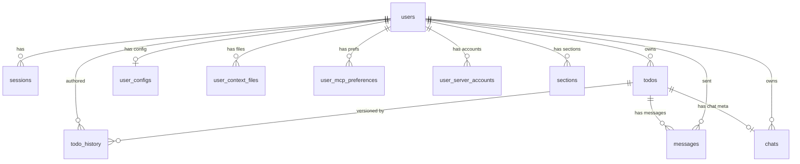

# Dossie Data Model Reference

This document describes the complete data model for the Dossie todo application, covering the PostgreSQL schema, in-memory state, API data shapes, and CRUD function reference.

---

## 1. Database Schema

The schema is defined in `db.py` via the `SCHEMA` constant (applied on first run) and incremental migrations in `_run_migrations()`. There are 11 tables total.

### 1.1 `users`

**DDL (from SCHEMA constant):**

```sql
CREATE TABLE users (
    id          UUID PRIMARY KEY DEFAULT gen_random_uuid(),
    email       TEXT UNIQUE NOT NULL,
    password    TEXT NOT NULL,
    name        TEXT,
    created_at  TIMESTAMPTZ DEFAULT now()
);
```

| Column | Type | Constraints | Notes |
|--------|------|-------------|-------|
| id | UUID | PK, DEFAULT gen_random_uuid() | Auto-generated |
| email | TEXT | UNIQUE NOT NULL | Lowered/stripped on insert |
| password | TEXT | NOT NULL | bcrypt hash |
| name | TEXT | nullable | Display name |
| created_at | TIMESTAMPTZ | DEFAULT now() | |

**Notes:** Root entity for multi-user support. All user-scoped tables reference `users(id)` with `ON DELETE CASCADE`. Password is stored as a bcrypt hash.

---

### 1.2 `sessions`

**DDL (from SCHEMA constant):**

```sql
CREATE TABLE sessions (
    token       TEXT PRIMARY KEY,
    user_id     UUID REFERENCES users(id) ON DELETE CASCADE,
    created_at  TIMESTAMPTZ DEFAULT now(),
    expires_at  TIMESTAMPTZ NOT NULL
);
```

| Column | Type | Constraints | Notes |
|--------|------|-------------|-------|
| token | TEXT | PK | `secrets.token_urlsafe(32)` |
| user_id | UUID | FK -> users(id) ON DELETE CASCADE | |
| created_at | TIMESTAMPTZ | DEFAULT now() | |
| expires_at | TIMESTAMPTZ | NOT NULL | Default: 720 hours from creation |

**Notes:** Session tokens are used for cookie-based auth and Bearer token auth. Expired sessions are filtered out at query time (`WHERE expires_at > now()`), not garbage-collected.

---

### 1.3 `todos`

**DDL (from SCHEMA constant):**

```sql
CREATE TABLE todos (
    id          TEXT PRIMARY KEY,
    user_id     UUID REFERENCES users(id) ON DELETE CASCADE,
    title       TEXT NOT NULL,
    description TEXT DEFAULT '',
    status      TEXT DEFAULT 'open' CHECK (status IN ('open', 'completed')),
    priority    TEXT DEFAULT 'none' CHECK (priority IN ('high', 'medium', 'low', 'none')),
    section     TEXT DEFAULT '',
    position    INT DEFAULT 0,
    created_at  TIMESTAMPTZ DEFAULT now(),
    updated_at  TIMESTAMPTZ DEFAULT now()
);
CREATE INDEX idx_todos_user ON todos(user_id, status);
```

| Column | Type | Constraints | Notes |
|--------|------|-------------|-------|
| id | TEXT | PK | First 8 chars of a UUID4 |
| user_id | UUID | FK -> users(id) ON DELETE CASCADE | |
| title | TEXT | NOT NULL | Stripped on insert |
| description | TEXT | DEFAULT '' | Stripped on insert |
| status | TEXT | DEFAULT 'open', CHECK IN ('open', 'completed') | |
| priority | TEXT | DEFAULT 'none', CHECK IN ('high', 'medium', 'low', 'none') | |
| section | TEXT | DEFAULT '' | Empty string = unsectioned |
| position | INT | DEFAULT 0 | Sort order within section |
| created_at | TIMESTAMPTZ | DEFAULT now() | |
| updated_at | TIMESTAMPTZ | DEFAULT now() | Updated on every change |

**Indexes:** `idx_todos_user(user_id, status)`

**Notes:** The `section` column stores the section name as a denormalized string (not a FK). Ordering is by `sections.position` then `todos.position` via a LEFT JOIN at query time. The `id` is a truncated UUID (`str(uuid.uuid4())[:8]`).

---

### 1.4 `todo_history`

**DDL (from SCHEMA constant):**

```sql
CREATE TABLE todo_history (
    id          BIGSERIAL PRIMARY KEY,
    todo_id     TEXT REFERENCES todos(id) ON DELETE CASCADE,
    user_id     UUID REFERENCES users(id),
    action      TEXT NOT NULL,
    snapshot    JSONB NOT NULL,
    changed_at  TIMESTAMPTZ DEFAULT now()
);
CREATE INDEX idx_todo_history_todo ON todo_history(todo_id, changed_at DESC);
```

| Column | Type | Constraints | Notes |
|--------|------|-------------|-------|
| id | BIGSERIAL | PK | Auto-increment |
| todo_id | TEXT | FK -> todos(id) ON DELETE CASCADE | |
| user_id | UUID | FK -> users(id) | No CASCADE (nullable ref) |
| action | TEXT | NOT NULL | One of: 'create', 'update', 'delete', 'restore' |
| snapshot | JSONB | NOT NULL | Full todo state at time of action |
| changed_at | TIMESTAMPTZ | DEFAULT now() | |

**Indexes:** `idx_todo_history_todo(todo_id, changed_at DESC)`

**Notes:** Snapshot is a JSON copy of the todo dict (`{id, title, description, status, priority, section, position}`). On update/delete, the *pre-change* state is recorded. On restore, the *pre-restore* state is recorded. Supports undo/restore via `restore_todo()`.

---

### 1.5 `messages`

**DDL (from SCHEMA constant + migration):**

```sql
CREATE TABLE messages (
    id          BIGSERIAL PRIMARY KEY,
    todo_id     TEXT REFERENCES todos(id) ON DELETE CASCADE,
    user_id     UUID REFERENCES users(id),
    role        TEXT NOT NULL CHECK (role IN ('user', 'assistant', 'tool')),
    content     TEXT NOT NULL,
    created_at  TIMESTAMPTZ DEFAULT now()
);
CREATE INDEX idx_messages_todo ON messages(todo_id, created_at);

-- Added by migration:
ALTER TABLE messages ADD COLUMN conversation_num INT DEFAULT 0;
```

| Column | Type | Constraints | Notes |
|--------|------|-------------|-------|
| id | BIGSERIAL | PK | Auto-increment |
| todo_id | TEXT | FK -> todos(id) ON DELETE CASCADE | |
| user_id | UUID | FK -> users(id) | |
| role | TEXT | NOT NULL, CHECK IN ('user', 'assistant', 'tool') | |
| content | TEXT | NOT NULL | |
| created_at | TIMESTAMPTZ | DEFAULT now() | |
| conversation_num | INT | DEFAULT 0 | Added by migration; groups messages into conversations |

**Indexes:** `idx_messages_todo(todo_id, created_at)`

**Notes:** Each todo has an associated chat. Messages are partitioned into conversations via `conversation_num`. Only messages matching the chat's `current_conversation` are returned by `get_messages()`. Tool-role messages can be excluded with `include_tool=False`.

---

### 1.6 `chats`

**DDL (from SCHEMA constant + migration):**

```sql
CREATE TABLE chats (
    todo_id     TEXT PRIMARY KEY REFERENCES todos(id) ON DELETE CASCADE,
    user_id     UUID REFERENCES users(id),
    unread      BOOLEAN DEFAULT FALSE,
    conversation_id TEXT
);

-- Added by migration:
ALTER TABLE chats ADD COLUMN current_conversation INT DEFAULT 0;
```

| Column | Type | Constraints | Notes |
|--------|------|-------------|-------|
| todo_id | TEXT | PK, FK -> todos(id) ON DELETE CASCADE | One chat per todo |
| user_id | UUID | FK -> users(id) | |
| unread | BOOLEAN | DEFAULT FALSE | Set TRUE when assistant sends a message |
| conversation_id | TEXT | nullable | External conversation ID (e.g., from LLM API) |
| current_conversation | INT | DEFAULT 0 | Added by migration; index of active conversation |

**Notes:** One-to-one relationship with `todos`. The `unread` flag is set to TRUE when an assistant message is added and cleared by `mark_chat_read()`. `current_conversation` allows switching between conversation threads within the same todo (restart/resume). `conversation_id` is reset to NULL on restart/resume.

---

### 1.7 `user_configs`

**DDL (from SCHEMA constant + migration):**

```sql
CREATE TABLE user_configs (
    user_id         UUID PRIMARY KEY REFERENCES users(id) ON DELETE CASCADE,
    providers       JSONB DEFAULT '{}',
    active_provider TEXT DEFAULT 'local',
    mcp_servers     JSONB DEFAULT '{}',
    tokens          JSONB DEFAULT '{}',
    system_prompt   TEXT,
    context_files   JSONB DEFAULT '{}',
    subagents_enabled BOOLEAN DEFAULT TRUE,
    max_subagents   INT DEFAULT 10,
    updated_at      TIMESTAMPTZ DEFAULT now()
);

-- Added by migration:
ALTER TABLE user_configs ADD COLUMN auto_approve_all BOOLEAN DEFAULT FALSE;
```

| Column | Type | Constraints | Notes |
|--------|------|-------------|-------|
| user_id | UUID | PK, FK -> users(id) ON DELETE CASCADE | One config per user |
| providers | JSONB | DEFAULT '{}' | LLM provider configurations |
| active_provider | TEXT | DEFAULT 'local' | Currently selected provider |
| mcp_servers | JSONB | DEFAULT '{}' | MCP server definitions |
| tokens | JSONB | DEFAULT '{}' | API tokens/credentials |
| system_prompt | TEXT | nullable | Custom system prompt |
| context_files | JSONB | DEFAULT '{}' | Legacy context files (see `user_context_files` table) |
| subagents_enabled | BOOLEAN | DEFAULT TRUE | Whether subagent spawning is allowed |
| max_subagents | INT | DEFAULT 10 | Maximum concurrent subagents |
| updated_at | TIMESTAMPTZ | DEFAULT now() | |
| auto_approve_all | BOOLEAN | DEFAULT FALSE | Added by migration; skip tool approval prompts |

**Notes:** Auto-created when a new user is registered via `create_user()`. The `providers`, `mcp_servers`, `tokens`, and `context_files` columns store JSON and are serialized via `json.dumps()` on write.

---

### 1.8 `user_context_files`

**DDL (from migration):**

```sql
CREATE TABLE user_context_files (
    id          UUID PRIMARY KEY DEFAULT gen_random_uuid(),
    user_id     UUID NOT NULL REFERENCES users(id) ON DELETE CASCADE,
    name        TEXT NOT NULL,
    content     TEXT NOT NULL,
    created_at  TIMESTAMPTZ DEFAULT now(),
    updated_at  TIMESTAMPTZ DEFAULT now(),
    UNIQUE(user_id, name)
);
CREATE INDEX idx_context_files_user ON user_context_files(user_id);
```

| Column | Type | Constraints | Notes |
|--------|------|-------------|-------|
| id | UUID | PK, DEFAULT gen_random_uuid() | |
| user_id | UUID | NOT NULL, FK -> users(id) ON DELETE CASCADE | |
| name | TEXT | NOT NULL, UNIQUE(user_id, name) | File identifier/name |
| content | TEXT | NOT NULL | File body |
| created_at | TIMESTAMPTZ | DEFAULT now() | |
| updated_at | TIMESTAMPTZ | DEFAULT now() | Updated on upsert |

**Indexes:** `idx_context_files_user(user_id)`

**Notes:** Stores per-user context files (e.g., CLAUDE.md-style instructions). Keyed by `(user_id, name)` with upsert semantics. Replaces the legacy `context_files` JSONB column on `user_configs`.

---

### 1.9 `user_mcp_preferences`

**DDL (from migration):**

```sql
CREATE TABLE user_mcp_preferences (
    user_id             UUID NOT NULL REFERENCES users(id) ON DELETE CASCADE,
    server_name         TEXT NOT NULL,
    enabled             BOOLEAN DEFAULT FALSE,
    disabled_tools      TEXT[] DEFAULT '{}',
    auto_approved_tools TEXT[] DEFAULT '{}',
    created_at          TIMESTAMPTZ DEFAULT now(),
    updated_at          TIMESTAMPTZ DEFAULT now(),
    PRIMARY KEY (user_id, server_name)
);
CREATE INDEX idx_mcp_prefs_user ON user_mcp_preferences(user_id);
```

| Column | Type | Constraints | Notes |
|--------|------|-------------|-------|
| user_id | UUID | NOT NULL, FK -> users(id) ON DELETE CASCADE | Composite PK part |
| server_name | TEXT | NOT NULL | Composite PK part |
| enabled | BOOLEAN | DEFAULT FALSE | Whether server is active for user |
| disabled_tools | TEXT[] | DEFAULT '{}' | Array of tool names to suppress |
| auto_approved_tools | TEXT[] | DEFAULT '{}' | Array of tool names that skip approval |
| created_at | TIMESTAMPTZ | DEFAULT now() | |
| updated_at | TIMESTAMPTZ | DEFAULT now() | |

**Indexes:** `idx_mcp_prefs_user(user_id)`

**Notes:** Per-user, per-server MCP preferences. Array operations use `array_append`/`array_remove` for idempotent add/remove of individual tool names.

---

### 1.10 `user_server_accounts`

**DDL (from migration):**

```sql
CREATE TABLE user_server_accounts (
    id          UUID PRIMARY KEY DEFAULT gen_random_uuid(),
    user_id     UUID NOT NULL REFERENCES users(id) ON DELETE CASCADE,
    server_name TEXT NOT NULL,
    config      JSONB NOT NULL DEFAULT '{}',
    created_at  TIMESTAMPTZ DEFAULT now(),
    updated_at  TIMESTAMPTZ DEFAULT now()
);
CREATE INDEX idx_server_accounts_user ON user_server_accounts(user_id, server_name);
```

| Column | Type | Constraints | Notes |
|--------|------|-------------|-------|
| id | UUID | PK, DEFAULT gen_random_uuid() | |
| user_id | UUID | NOT NULL, FK -> users(id) ON DELETE CASCADE | |
| server_name | TEXT | NOT NULL | e.g., 'imap', 'caldav' |
| config | JSONB | NOT NULL, DEFAULT '{}' | Server-specific config (credentials, endpoints, etc.) |
| created_at | TIMESTAMPTZ | DEFAULT now() | |
| updated_at | TIMESTAMPTZ | DEFAULT now() | |

**Indexes:** `idx_server_accounts_user(user_id, server_name)`

**Notes:** Stores per-user credentials and configuration for external services (IMAP, CalDAV, etc.). A user can have multiple accounts per server_name. No unique constraint on `(user_id, server_name)` -- multiple accounts are allowed.

---

### 1.11 `sections`

**DDL (from migration):**

```sql
CREATE TABLE sections (
    id          BIGSERIAL PRIMARY KEY,
    user_id     UUID NOT NULL REFERENCES users(id) ON DELETE CASCADE,
    name        TEXT NOT NULL,
    position    INT DEFAULT 0,
    directives  TEXT DEFAULT '',
    created_at  TIMESTAMPTZ DEFAULT now(),
    UNIQUE(user_id, name)
);
CREATE INDEX idx_sections_user ON sections(user_id, position);
```

| Column | Type | Constraints | Notes |
|--------|------|-------------|-------|
| id | BIGSERIAL | PK | Auto-increment |
| user_id | UUID | NOT NULL, FK -> users(id) ON DELETE CASCADE | |
| name | TEXT | NOT NULL, UNIQUE(user_id, name) | Section display name |
| position | INT | DEFAULT 0 | Sort order |
| directives | TEXT | DEFAULT '' | Section-level instructions/metadata |
| created_at | TIMESTAMPTZ | DEFAULT now() | |

**Indexes:** `idx_sections_user(user_id, position)`

**Notes:** Sections group todos. The `todos.section` column references `sections.name` by value (not a formal FK). When a section is deleted, its todos have their `section` set to `''` (unsectioned). New sections are inserted at position 0, shifting existing sections down. On initial migration, sections are populated from distinct `todos.section` values.

---

## 2. Entity Relationship Diagram



---

## 3. In-Memory State

These global variables are defined in `app.py` and hold runtime state that does not persist across server restarts.

| Variable | Type | Lifecycle | Purpose |
|----------|------|-----------|---------|
| `_jobs` | `dict[str, dict]` | Created when a job is spawned; entries persist until explicitly cleaned up | Background jobs (shell commands, subagents). Each value: `{id, label, job_key, status, output_lines, proc, created_at, user_id}` |
| `_mcp_managers` | `dict[str, MCPManager]` | Created lazily on first MCP tool call per user; stopped on server shutdown | Per-user MCP server connection managers. Keyed by `user_id`. |
| `_mcp_managers_lock` | `threading.Lock` | Created at module load; lives for process lifetime | Synchronizes access to `_mcp_managers` dict |
| `_pending_approvals` | `dict[str, dict]` | Created when a tool call requires approval; removed after approval/denial/timeout | Runtime tool approval queue. Each value: `{event, approved, server_name, tool_name}` where `event` is a `threading.Event` |
| `_approvals_lock` | `threading.Lock` | Created at module load; lives for process lifetime | Synchronizes access to `_pending_approvals` dict |
| `_undo_stack` | `deque[tuple[list[dict], list[dict]]]` | Created at module load; used in file mode only | Global undo stack for file-based mode. Each entry is `(before_todos, after_todos)`. Max 30 entries. |
| `_undo_stacks` | `dict[str, deque]` | Entries created per user on first undo-eligible action in DB mode | Per-user undo stacks for database mode. Keyed by `user_id`. |
| `_pty_sessions` | `dict[str, dict]` | Created when a PTY session is spawned; removed when session ends | Active pseudo-terminal sessions. Each value: `{id, todo_id, title, tmux_target, alive, created_at, needs_auto_send, resume_id}` |
| `_user_temp_dirs` | `dict[str, str]` | Created when MCP config files are written to temp dirs; cleaned up on manager stop | Per-user temporary directories for MCP server config files. Keyed by `user_id`. |

---

## 4. Key Data Shapes

TypeScript-style interfaces for the major API objects as returned by `db.py` functions and exposed by the REST API.

### Todo

```typescript
interface Todo {
  id: string;           // 8-char truncated UUID
  title: string;
  description: string;
  status: "open" | "completed";
  priority: "high" | "medium" | "low" | "none";
  section: string;      // empty string if unsectioned
  position: number;
}
```

### Message

```typescript
interface Message {
  role: "user" | "assistant" | "tool";
  content: string;
  created_at: string;   // ISO 8601 timestamp
}
```

### HistoryEntry

```typescript
interface HistoryEntry {
  id: number;
  todo_id: string;
  action: "create" | "update" | "delete" | "restore";
  snapshot: Todo;       // full todo state at time of action
  changed_at: string;   // ISO 8601 timestamp
}
```

### Section

```typescript
interface Section {
  name: string;
  position: number;
  directives: string;
}
```

### UserConfig

```typescript
interface UserConfig {
  providers: Record<string, any>;       // LLM provider configs
  active_provider: string;              // e.g., "local", "anthropic"
  mcp_servers: Record<string, any>;     // MCP server definitions
  tokens: Record<string, any>;          // API tokens
  system_prompt: string | null;
  context_files: Record<string, any>;   // legacy; see user_context_files table
  subagents_enabled: boolean;
  max_subagents: number;
  auto_approve_all: boolean;
}
```

### Job

```typescript
interface Job {
  id: string;
  label: string;
  job_key: string;
  status: string;       // e.g., "running", "done", "error"
  output_lines: string[];
  proc: any;            // subprocess handle (not serialized)
  created_at: string;
  user_id: string;
}
```

### MCPStatus

```typescript
interface MCPStatus {
  connected: boolean;
  tool_count: number;
}
// Stored per-server in MCPManager._server_status: Record<string, MCPStatus>
```

---

## 5. CRUD Function Reference

All public functions exported from `db.py`, organized by domain. Private helpers (prefixed with `_`) are noted where relevant.

### Infrastructure

| Function | Signature | Return Type | Notes |
|----------|-----------|-------------|-------|
| `init` | `(database_url: str)` | `None` | Initialize connection pool and run migrations |
| `close` | `()` | `None` | Shut down connection pool |

### Auth

| Function | Signature | Return Type | Notes |
|----------|-----------|-------------|-------|
| `create_user` | `(email: str, password: str, name: str \| None = None)` | `dict` | Returns `{id, email, name, created_at}`. Also creates default `user_configs` row. Raises on duplicate email. |
| `verify_user` | `(email: str, password: str)` | `dict \| None` | Returns `{id, email, name}` or None if credentials invalid |
| `create_session` | `(user_id: str, expires_hours: int = 720)` | `str` | Returns session token string |
| `get_session_user` | `(token: str)` | `dict \| None` | Returns `{id, email, name}` or None if expired/invalid |
| `delete_session` | `(token: str)` | `None` | Deletes session (logout) |

### Todos

| Function | Signature | Return Type | Notes |
|----------|-----------|-------------|-------|
| `get_todos` | `(user_id: str, status_filter: str = "all")` | `list[dict]` | Returns list of Todo dicts. `status_filter`: `"all"`, `"open"`, or `"completed"`. Ordered by section position then item position. |
| `get_todo` | `(user_id: str, todo_id: str)` | `dict \| None` | Returns single Todo dict scoped to user, or None |
| `get_todos_mtime` | `(user_id: str)` | `float` | Returns epoch timestamp of most recent `updated_at` across all user's todos, or 0.0 |
| `create_todo` | `(user_id: str, title: str, description: str = "", priority: str = "none", section: str = "")` | `dict` | Returns new Todo dict. Auto-generates 8-char ID. Records 'create' history. Ensures section exists. |
| `update_todo` | `(user_id: str, todo_id: str, **fields)` | `dict \| None` | Allowed fields: `title`, `description`, `status`, `priority`, `section`, `position`. Returns updated Todo dict or None. Records 'update' history (pre-change snapshot). |
| `delete_todo` | `(user_id: str, todo_id: str)` | `bool` | Returns True if deleted. Records 'delete' history (pre-delete snapshot). |
| `search_todos` | `(user_id: str, query: str)` | `list[dict]` | ILIKE search on title and description. Returns list of Todo dicts ordered by section, position. |
| `bulk_update_todos` | `(user_id: str, todos: list[dict])` | `None` | Upsert multiple todos (for reordering, section moves). Uses ON CONFLICT(id) DO UPDATE. |

### Sections

| Function | Signature | Return Type | Notes |
|----------|-----------|-------------|-------|
| `get_sections` | `(user_id: str)` | `list[dict]` | Returns list of `{name, position, directives}` ordered by position |
| `upsert_section` | `(user_id: str, name: str, position: int \| None = None, directives: str \| None = None)` | `None` | Create or update. Auto-assigns next position if `position` is None. Uses ON CONFLICT(user_id, name). |
| `reorder_sections` | `(user_id: str, section_names: list[str])` | `None` | Sets position from ordered list index. Uses ON CONFLICT(user_id, name) DO UPDATE. |
| `delete_section` | `(user_id: str, name: str)` | `None` | Deletes section and sets `todos.section = ''` for affected todos |

Private helper:

| Function | Signature | Return Type | Notes |
|----------|-----------|-------------|-------|
| `_ensure_section` | `(cur, user_id: str, section: str)` | `None` | Called within a transaction. Creates section at position 0 if it does not exist, shifting others down. |

### History

| Function | Signature | Return Type | Notes |
|----------|-----------|-------------|-------|
| `get_history` | `(user_id: str, limit: int = 30)` | `list[dict]` | Returns `{id, todo_id, action, snapshot, changed_at}` ordered by `changed_at DESC` |
| `get_todo_history` | `(user_id: str, todo_id: str, limit: int = 30)` | `list[dict]` | Returns `{id, action, snapshot, changed_at}` for a specific todo, ordered by `changed_at DESC` |
| `restore_todo` | `(user_id: str, history_id: int)` | `dict \| None` | Restores a todo from a history snapshot. Records 'restore' history of pre-restore state. Uses upsert so it works for both existing and deleted todos. Returns restored Todo dict. |

Private helper:

| Function | Signature | Return Type | Notes |
|----------|-----------|-------------|-------|
| `_record_history` | `(cur, todo_id: str, user_id: str, action: str, snapshot: dict)` | `None` | Inserts history record within an existing transaction cursor |

### Messages (Chat)

| Function | Signature | Return Type | Notes |
|----------|-----------|-------------|-------|
| `get_messages` | `(todo_id: str, limit: int = 100, include_tool: bool = True)` | `list[dict]` | Returns messages for current conversation. Each: `{role, content, created_at}`. Filters by `conversation_num`. |
| `add_message` | `(todo_id: str, user_id: str, role: str, content: str)` | `None` | Adds message to current conversation. Upserts chat row; sets `unread=True` if role is 'assistant'. |
| `restart_conversation` | `(todo_id: str)` | `None` | Increments `current_conversation`, clears `unread` and `conversation_id`. Old messages preserved. |
| `resume_conversation` | `(todo_id: str, conv_num: int)` | `None` | Sets `current_conversation` to specified number. Clears `unread` and `conversation_id`. |
| `get_conversations` | `(todo_id: str)` | `tuple[int, list[dict]]` | Returns `(current_num, conversations)`. Each conversation: `{num, started, last_msg, message_count}`. Ordered by `conversation_num DESC`. |
| `get_conversation_messages` | `(todo_id: str, conversation_num: int, limit: int = 100)` | `list[dict]` | Returns messages from a specific conversation. Each: `{role, content, created_at}`. |
| `delete_messages` | `(todo_id: str)` | `None` | Deletes all messages and chat metadata for a todo |
| `get_chat_meta` | `(todo_id: str)` | `dict \| None` | Returns `{unread, conversation_id}` or None |
| `mark_chat_read` | `(todo_id: str)` | `None` | Sets `unread = FALSE` |
| `mark_chat_unread` | `(todo_id: str, user_id: str)` | `None` | Upserts chat row with `unread = TRUE` |
| `get_unread_todo_ids` | `(user_id: str)` | `set[str]` | Returns set of todo_ids with unread chats for user |

### Config

| Function | Signature | Return Type | Notes |
|----------|-----------|-------------|-------|
| `get_config` | `(user_id: str)` | `dict` | Returns UserConfig dict. Returns defaults if no row found. |
| `save_config` | `(user_id: str, **fields)` | `None` | Partial update. Allowed fields: `providers`, `active_provider`, `mcp_servers`, `tokens`, `system_prompt`, `context_files`, `subagents_enabled`, `max_subagents`, `auto_approve_all`. JSONB fields are serialized via `json.dumps()`. |

### Context Files

| Function | Signature | Return Type | Notes |
|----------|-----------|-------------|-------|
| `get_context_files` | `(user_id: str)` | `dict[str, str]` | Returns `{name: content}` for all files, ordered by name |
| `get_context_file` | `(user_id: str, name: str)` | `str \| None` | Returns content or None |
| `upsert_context_file` | `(user_id: str, name: str, content: str)` | `None` | Create or update. Uses ON CONFLICT(user_id, name). |
| `delete_context_file` | `(user_id: str, name: str)` | `bool` | Returns True if file existed |

### MCP Preferences

| Function | Signature | Return Type | Notes |
|----------|-----------|-------------|-------|
| `get_mcp_preferences` | `(user_id: str)` | `dict` | Returns `{server_name: {enabled, disabled_tools, auto_approved_tools}}` |
| `set_server_enabled` | `(user_id: str, server_name: str, enabled: bool)` | `None` | Upsert; sets enabled flag for a server |
| `set_tool_disabled` | `(user_id: str, server_name: str, tool_name: str, disabled: bool)` | `None` | Idempotent add/remove of tool name in `disabled_tools` array |
| `set_tool_auto_approved` | `(user_id: str, server_name: str, tool_name: str, auto_approved: bool)` | `None` | Idempotent add/remove of tool name in `auto_approved_tools` array |

### Server Accounts

| Function | Signature | Return Type | Notes |
|----------|-----------|-------------|-------|
| `get_server_accounts` | `(user_id: str, server_name: str)` | `list[dict]` | Returns list of `{id, config}` ordered by `created_at` |
| `add_server_account` | `(user_id: str, server_name: str, config: dict)` | `dict` | Returns `{id, config}` |
| `update_server_account` | `(user_id: str, account_id: str, config: dict)` | `bool` | Returns True if account found and updated |
| `delete_server_account` | `(user_id: str, account_id: str)` | `bool` | Returns True if account found and deleted |
